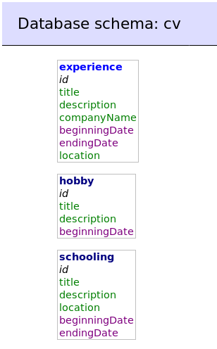

# Correction !

Finis, on lève les doigts du clavier, je ramasse les fichiers !

Pour la beauté du sport, j'ai passé du temps à me soumettre à l'exercice. Tout est la. C'est un projet complexe pour votre niveau. Je vous invite à passer du temps pour bien comprendre tout ce qui se passe.

Les codes sources des deux fichiers ([index.php](src/index.php) / [admin.php](src/admin.php)) se trouvent dans le dossier src.

Les commandes pour créer la base de donnée ainsi que les tables sont dans le fichier [mysql-dump.sql](mysql-dump.sql).

J'ai finalement opté pour 3 tables différentes (schooling, experience, hobby).

Le site est hebergé sur mon serveur [cv Eddie BARRACO](https://cv.eddiebarraco.fr) [cv ADMIN Eddie BARRACO](https://cv.eddiebarraco.fr/admin.php)(user: admin; mdp: admin);

On se revois probablement dans deux semaines pour la partie POO (Programmation Object Oriented). Bonne chance pour le reste de votre formation !
